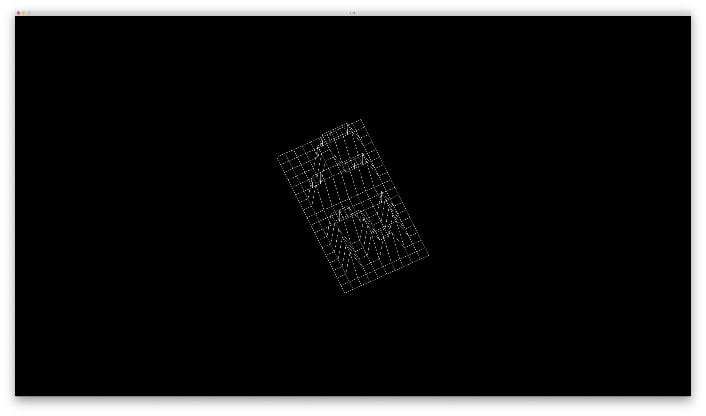
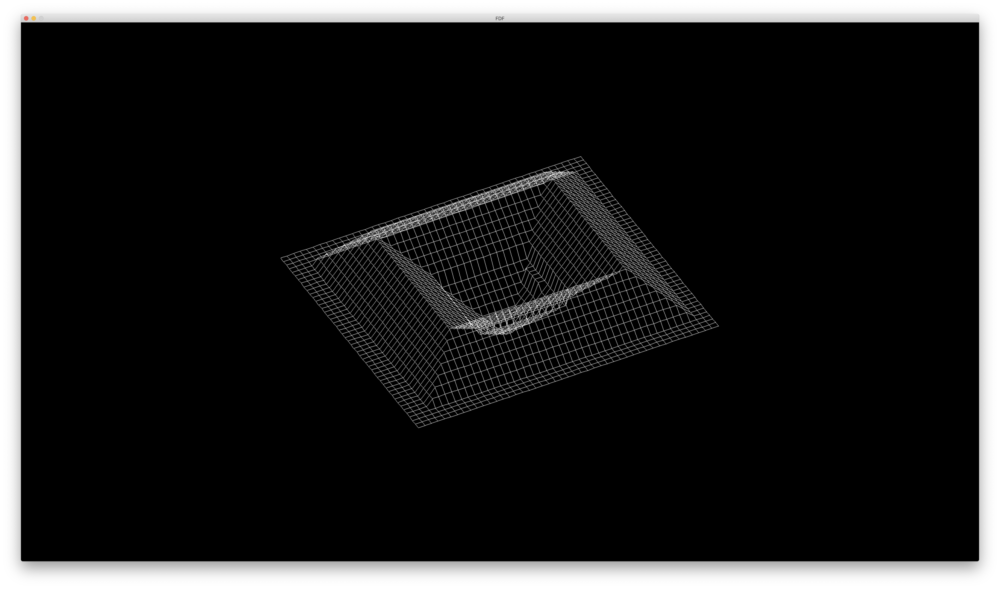
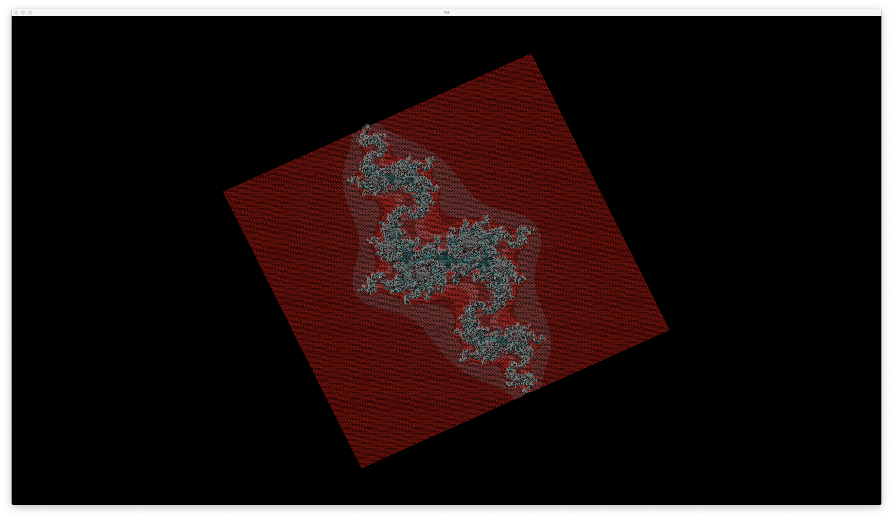

# FDF

이 프로젝트는 42서울에서 경험할 수 있는 첫 번째 그래픽 과제 중 하나이다. 입력으로 주어지는 FDF 파일을 Rendering 하는 과제이다. FDF 파일은 높이로만 이루어져 있는 Map이다.

```c

0  0  0  0  0  0  0  0  0  0  0  0  0  0  0  0  0  0  0
0  0  0  0  0  0  0  0  0  0  0  0  0  0  0  0  0  0  0
0  0 10 10  0  0 10 10  0  0  0 10 10 10 10 10  0  0  0
0  0 10 10  0  0 10 10  0  0  0  0  0  0  0 10 10  0  0
0  0 10 10  0  0 10 10  0  0  0  0  0  0  0 10 10  0  0
0  0 10 10 10 10 10 10  0  0  0  0 10 10 10 10  0  0  0
0  0  0 10 10 10 10 10  0  0  0 10 10  0  0  0  0  0  0
0  0  0  0  0  0 10 10  0  0  0 10 10  0  0  0  0  0  0
0  0  0  0  0  0 10 10  0  0  0 10 10 10 10 10 10  0  0
0  0  0  0  0  0  0  0  0  0  0  0  0  0  0  0  0  0  0
0  0  0  0  0  0  0  0  0  0  0  0  0  0  0  0  0  0  0


```

위에 주어진 FDF 파일을 아래와 같이 Rendering 한다. 



## Examples





## 좀 더 이론적인 설명이 궁금하다면
- [Isometric Projection](md/Isometric.md)
- [Bremenham 알고리즘](md/Bremenham.md)

## 프로젝트를 직접 테스트해보고 싶다면

```sh

## macOS 환경이 아니면 실행이 안 될 수 있습니다. 
git clone https://github.com/jasongoo827/FDF.git
make
./fdf test_maps/"fdf 파일 이름"

```