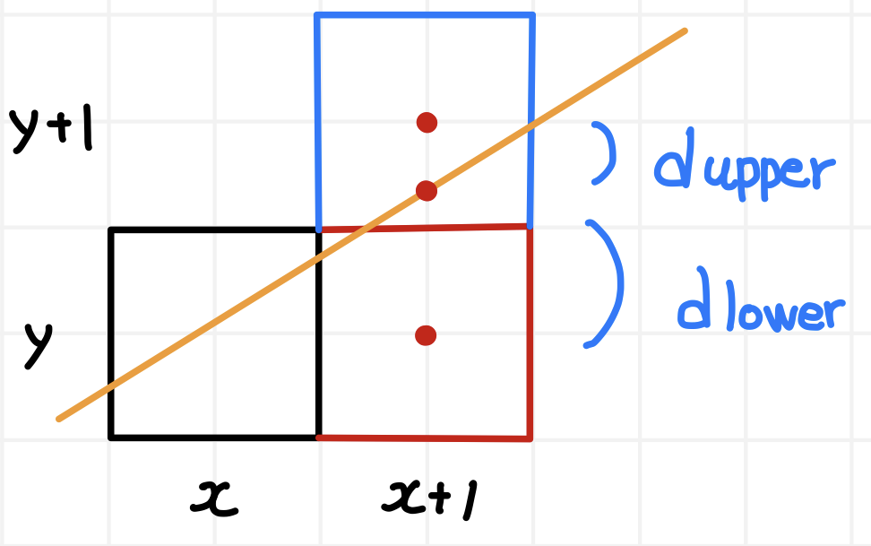

# Bresenham 알고리즘

화면에 직선을 그리기 위해 고려할 것들
- 현대 모니터들은 전부 픽셀로 이루어져 있다.
- 이 위에 직선을 그린다면 최대한 직선에 가깝게 표현되어야 한다. 이 뜻은 픽셀들이 연속으로 이어져 있어야 하며 끊기지 않아야 한다는 것이다.
- 픽셀의 중심이 좌표의 정수 부분이 된다.



(x, y)에 픽셀을 찍었을 때, 어차피 다음 픽셀은 (x + 1, y) 또는 (x + 1, y + 1)이다. 우리는 실제 직선의 기울기로 측정한 y좌표와 그 위, 아래에 있는 y좌표들 간의 차이의 비교를 통해 어느 점에 픽셀을 찍을지 정할 수 있다.

Bresenham 알고리즘의 주요 특징은, 부동 소수점 연산을 사용하지 않고 정수 연산만 사용하기 때문에 성능이 좋다는 것이다. 하지만 기울기는 분명 정수가 아닐 수 있는데, 어떻게 정수 연산만 사용한다는 것인가? 이에 대해 설명해 보겠다.

```c

// k번째 픽셀 x[k], y[k]
// 직선은 y = mx + b
// m = dy / dx (dx, dy는 정수)
// 직선이 k + 1 번째 수직선과 만나는 점 x, y
d_upper = (y[k] + 1) - y = y[k] + 1 - (mx[k] + b)
d_lower = y - y[k] = mx[k] + b - y[k]
d_lower - d_upper = 2m(x[k] + 1) - 2y[k] + 2b - 1

// 양변에 dx를 곱한다.
// Pk = dx(d_lower - d_upper)
Pk = 2dy(x[k] + 1) - 2dx * y[k] + dx(2b - 1)
   = 2dy * x[k] - 2dx * y[k] + C

// k + 1 번째 픽셀은 Pk의 부호에 따라 y 좌표가 y[k] 또는 y[k] + 1 이 된다.
// 하지만 x좌표는 x[k] + 1로 일정.
Pk+1 = 2dy * x[k+1] - 2dx * y[k+1] + C
Pk+1 - Pk = 2dy * (x[k+1] - x[k]) - 2dx * (y[k+1] - y[k])
          = 2dy - 2dx * (y[k+1] - y[k])

// Pk+1 - Pk가 정수이기 때문에, P0만 정수임을 보인다면 모두 정수임을 알 수 있다.

P0 = 2dy * x[0] - 2dx * y[0] + 2dy + dx(2b - 1)
b = y - mx
  = y[0] - (dy/dx) * x[0]
P0 = 2dy * x[0] - 2dx * y[0] + 2dy + 2dx * y[0] - 2dy * x[0] - dx
   = 2dy - dx

// P0가 정수이므로 Pk는 정수이다.

```

<br>

정수 알고리즘임이 증명됐으니, Pk를 이용해서 점을 찍을 수 있다.
``
```c

// Pk = dx(d_lower - d_upper)
// d_lower가 더 크면 y[k] + 1, d_upper가 더 크면 y[k]를 선택.
// Pk+1 - Pk = 2dy - 2dx * (y[k+1] - y[k])
// Pk > 0 이라면, y[k+1] = y[k] + 1
// Pk < 0 이라면,  y[k+1] = y[k]

void	bre_low_plus(t_vertex cur, t_vertex next, t_image *img)
{
	int	two_dy;
	int	two_dy_minux_dx;
	int	p;

	two_dy = 2 * abs(next.co.y - cur.co.y);
	two_dy_minux_dx = 2 * (abs(next.co.y - cur.co.y) \
	- abs(next.co.x - cur.co.x));
	p = 2 * abs(next.co.y - cur.co.y) - abs(next.co.x - cur.co.x);
	put_pixel(img, cur);
	while (cur.co.x < next.co.x)
	{
		cur.co.x++;
		if (p < 0)
			p += two_dy;
		else
		{
			cur.co.y++;
			p += two_dy_minux_dx;
		}
		put_pixel(img, cur);
	}
}

```