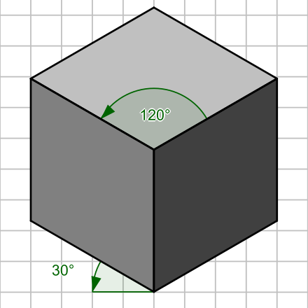

# Isometric Projection

해당 프로젝트에서 사용되는 핵심적인 개념은 Isometric Projection(등축 투영)이다. 이는 3차원 물체를 평면 상에 표현하기 위한 방법의 일종으로, x, y, z 세 좌표 축이 이루는 각도가 모두 120도를 이루는 것이 특징이다.  

<br>



그렇다면 위와 같은 이미지로 물체를 보려면, 해당 물체를 어디에서 바라봐야 할까? 물체의 대각선을 잇는 방향에서 바라본다면, 3차원 정육면체가 이미지처럼 보일 것이다. 따라서 3차원 좌표계를 바라보는 방향의 좌표계로 바꿀 수 만 있다면, 등축 투영을 구현할 수 있다. 

## View Transform
위에서 설명한 것처럼 3차원 월드 좌표계를 바라보는 방향의 좌표계 즉, 카메라 좌표계로 바꿔야 한다. 카메라가 위치한 곳을 원점으로, 카메라가 바라보는 방향을 기준으로 좌표계를 설정한다. 좌표계를 변환하는 과정은 다음과 같다.

1. 카메라가 바라보는 방향을 카메라 좌표계의 z축으로 설정한다. 
2. 월드 좌표계의 위쪽 방향을 나타내는 Up Vector와 카메라 좌표계를 외적해서, 카메라 좌표계의 x축과 y축을 구한다.
3. 새로 구한 축들을 가지고 World -> View 좌표계 변환 행렬을 구한다.
4. 물체의 좌표에 변환 행렬을 곱해서 좌표계를 바꾼다.

1 - 2 과정을 통해 축을 구하는 것은 어렵지 않기 때문에, 우리는 변환 행렬을 구하는 데 집중할 것이다.

카메라 좌표계에서 월드 좌표계로의 좌표 변경 행렬을 W, 카메라의 위치를 Qw = (Qx, Qy, Qz, 1), 카메라의 x축을 Uw = (Ux, Uy, Uz, 0), 카메라의 y축을 Vw = (Vx, Vy, Vz, 0), 카메라의 z축을 Ww = (Wx, Wy, Wz, 0) 이라고 하자. 여기서 성분을 4개 쓰는 이유는 동차좌표를 사용하기 때문이다. W 행렬은 다음과 같다.

```c

    | Ux, Uy, Uz, 0 |
W = | Vx, Vy, Vz, 0 |
    | Wx, Wy, Wz, 0 |
    | Qx, Qy, Qz, 1 |

```

따라서 우리가 구하고자 하는 월드 좌표계에서 카메라 좌표계로의 변환 행렬은 W의 역행렬과 같다.
일반적으로 월드 좌표계와 카메라 좌표계는 위치와 방향만 다르므로, W = RT라고 둘 수 있다(R은 Rotation, T는 Translation). 이처럼 W를 회전행렬과 이동행렬로 분해하면 그 역행렬을 구하기가 쉬워진다.

```c

    	| 1, 0, 0, 0 | | Ux, Vx, Wx, 0 | 	 | Ux, Vx, Wx, 0 |
W -1= 	| 0, 1, 0, 0 | | Uy, Vy, Wy, 0 |  =  | Uy, Vy, Wy, 0 |
    	| 0, 0, 1, 0 | | Uz, Vz, Wz, 0 |     | Uz, Vz, Wz, 0 |
    	|-Qx-Qy-Qz 1 | |  0,  0,  0, 1 |     |-Q·U-Q·V-Q·W 1 |

```

해당 행렬을 코드로 구현하면 다음과 같다.

```c

void	transform_matrix(t_map *map)
{
	t_vector	*r0;
	t_vector	*r1;
	t_vector	*r2;
	double		**tmp;

	tmp = alloc_dmatrix(4);
	// 카메라의 z축
	r2 = normalize_vector1(map->la_matrix->eye_direction);
	// z축과 세계공간의 up vector 외적
	r0 = cross_vector(r2, map->la_matrix->up_direction);
	normalize_vector2(r0);
	// r2와 r0를 외적해서 나머지 축 구하기
	r1 = cross_vector(r2, r0);
	normalize_vector2(r1);
	// 변환 행렬 구하기
	init_lookat_matrix(map, r0, r1, r2);
	// 나머지 연산들은 예쁘게 Rendering 하기 위한 작업들이다.
	init_ry_matrix(map->la_matrix->r_matrix, M_PI / 4);
	mul_matrix(map->la_matrix->matrix, map->la_matrix->r_matrix, tmp);
	calculate_matrix(map, tmp);
	change_direction(map);
	calculate_max(map);
	calculate_scale(map);
	scale_transform(map, (double)map->scale);
	calculate_max(map);
	calculate_start_trans(map, map->start_x, map->start_y);
	copy_matrix_values(map, &map->back_up, &map->matrix);
	translate_transform(map, map->start_x_trans, map->start_y_trans);
	free_vector(r0, r1, r2);
	free_dmatrix(tmp);
}

```

```c

// 4 * 4 크기의 변환 행렬을 만든다.
void	init_lookat_matrix(t_map *map, t_vector *r0, t_vector *r1, t_vector *r2)
{
	double		d0;
	double		d1;
	double		d2;
	double		**matrix;

	d0 = dot_vector(map->la_matrix->eye_position, r0);
	d1 = dot_vector(map->la_matrix->eye_position, r1);
	d2 = dot_vector(map->la_matrix->eye_position, r2);
	matrix = map->la_matrix->matrix;
	matrix[0][0] = r0->c[X];
	matrix[1][0] = r0->c[Y];
	matrix[2][0] = r0->c[Z];
	matrix[0][1] = r1->c[X];
	matrix[1][1] = r1->c[Y];
	matrix[2][1] = r1->c[Z];
	matrix[0][2] = r2->c[X];
	matrix[1][2] = r2->c[Y];
	matrix[2][2] = r2->c[Z];
	matrix[0][3] = 0;
	matrix[1][3] = 0;
	matrix[2][3] = 0;
	matrix[3][0] = d0;
	matrix[3][1] = d1;
	matrix[3][2] = d2;
	matrix[3][3] = 1;
}

```